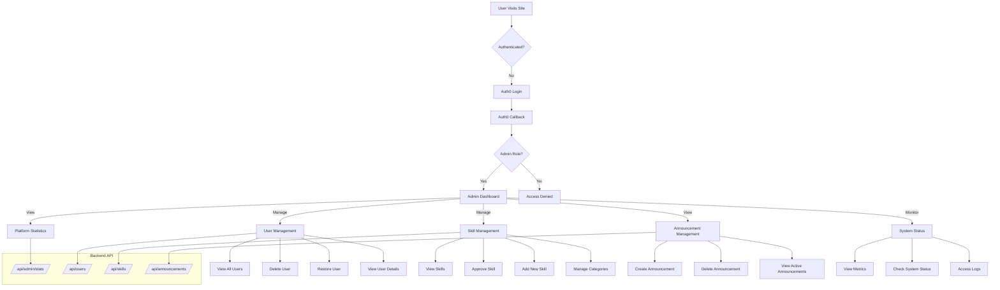
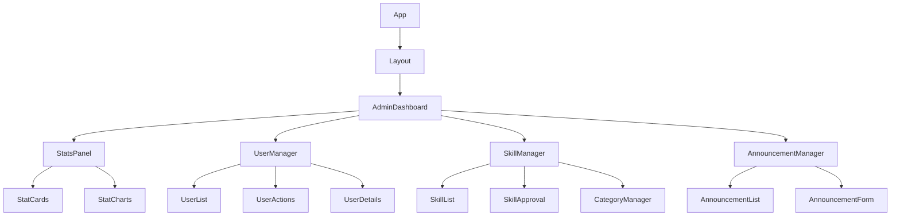
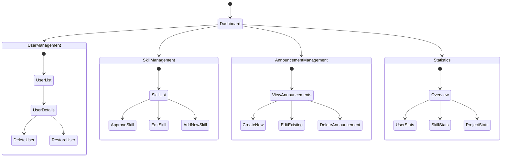

# Admin Technical Flow



## API Endpoints Detail

### Admin Statistics
- `GET /api/admin/stats/` - Get platform statistics
- `GET /api/admin/stats/users` - Get user statistics
- `GET /api/admin/stats/skills` - Get skill statistics
- `GET /api/admin/stats/projects` - Get project statistics

### User Management
- `GET /api/users/` - List all users
- `DELETE /api/delete-user/<email>/` - Delete user
- `POST /api/restore-user/<email>/` - Restore user
- `GET /api/users/<id>/` - Get user details

### Skill Management
- `GET /api/skills/` - List all skills
- `POST /api/skills/` - Create new skill
- `PUT /api/skills/<id>/` - Update skill
- `POST /api/skills/approve/<id>/` - Approve skill
- `DELETE /api/skills/<id>/` - Delete skill

### Announcement Management
- `GET /api/announcements/` - List announcements
- `POST /api/announcements/create/` - Create announcement
- `DELETE /api/announcements/<id>/` - Delete announcement
- `GET /api/announcements/active/` - Get active announcements

## Component Hierarchy



## State Management Flow



## Admin Access Control

```mermaid
graph TD
    Login[Admin Login] --> TokenCheck{Valid Token?}
    TokenCheck -->|Yes| RoleCheck{Admin Role?}
    TokenCheck -->|No| Redirect[Redirect to Login]
    
    RoleCheck -->|Yes| AdminAccess[Grant Admin Access]
    RoleCheck -->|No| Unauthorized[Access Denied]
    
    AdminAccess --> CheckPermissions{Check Permissions}
    CheckPermissions -->|Full Access| AllFeatures[All Admin Features]
    CheckPermissions -->|Limited Access| LimitedFeatures[Limited Features]
