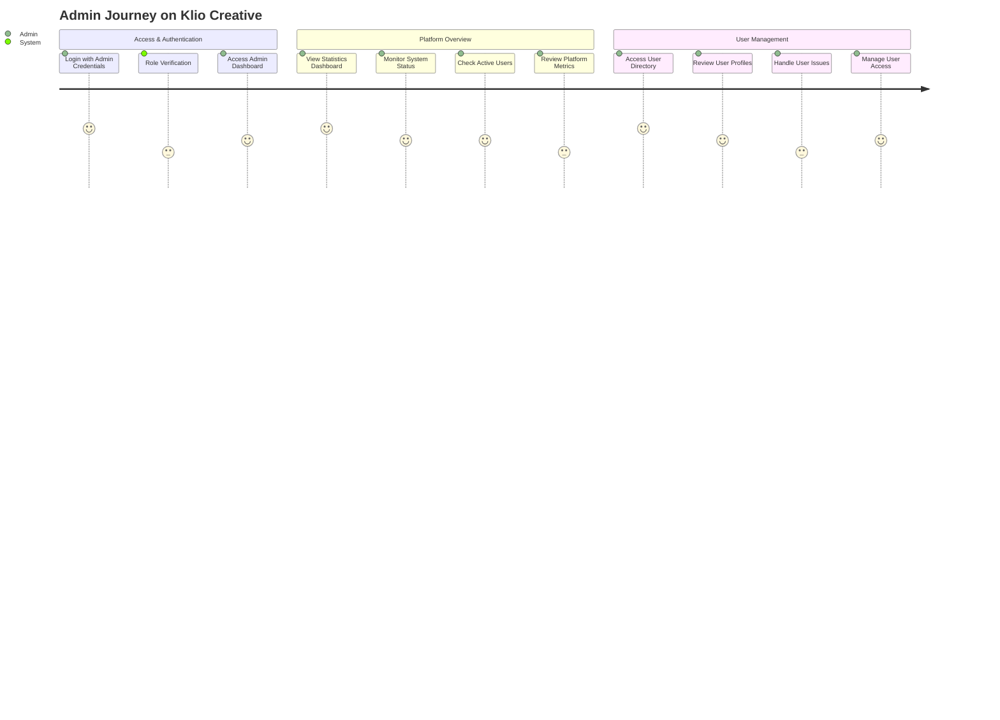
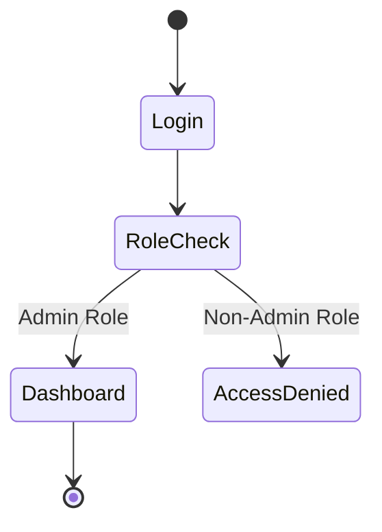
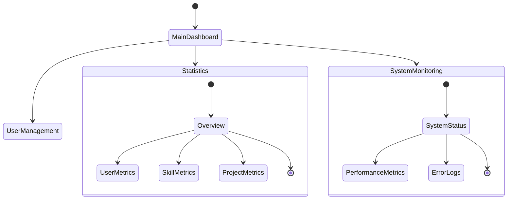
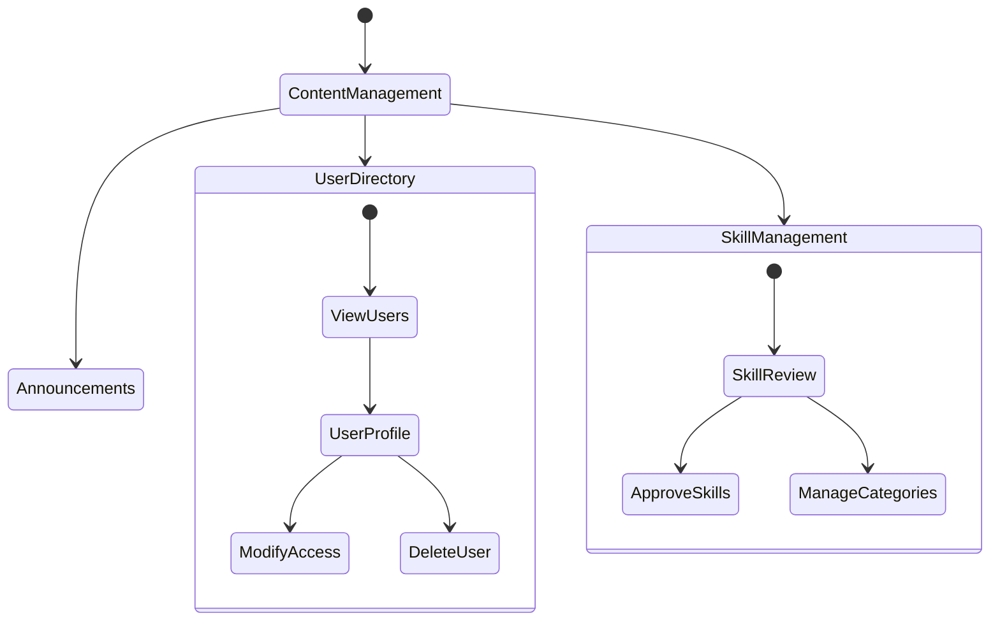

# Admin User Journey Map

## Detailed User States & Interactions

### 1. Admin Authentication Flow

### 2. Dashboard & Statistics Management

### 3. User & Content Management

## Key Admin Touchpoints & States

### Platform Overview
1. **Statistics Dashboard**
   - Real-time metrics
   - User activity tracking
   - System performance
   - Key indicators

2. **System Monitoring**
   - Performance metrics
   - Error tracking
   - System logs
   - Status alerts

### User Management
1. **User Directory**
   - View all users
   - Search functionality
   - Filter options
   - Bulk actions

2. **Profile Management**
   - View user details
   - Modify permissions
   - Handle deletions
   - Restore accounts

### Content Management
1. **Skill System**
   - Review new skills
   - Manage categories
   - Update descriptions
   - Handle approvals

2. **Announcement System**
   - Create announcements
   - Set visibility
   - Manage duration
   - Track engagement

## Administrative Tasks

### Daily Operations
1. **User Management**
   - Review new registrations
   - Handle user reports
   - Manage permissions
   - Address issues

2. **System Maintenance**
   - Monitor performance
   - Check error logs
   - Review metrics
   - Update settings

3. **Content Oversight**
   - Approve skills
   - Review portfolios
   - Manage announcements
   - Update categories

### Critical Workflows
1. **User Issue Resolution**
   - Review reported issues
   - Investigate problems
   - Take corrective action
   - Document resolution

2. **System Issue Management**
   - Monitor alerts
   - Diagnose problems
   - Implement fixes
   - Track resolution

3. **Content Moderation**
   - Review flagged content
   - Assess violations
   - Take action
   - Update policies

## Error Handling & Recovery

### System Issues
1. **Performance Problems**
   - Monitor alerts
   - Diagnose cause
   - Apply fixes
   - Verify resolution

2. **Data Issues**
   - Identify problems
   - Backup verification
   - Correction process
   - Validation checks

### User-Related Issues
1. **Access Problems**
   - Verify credentials
   - Check permissions
   - Reset access
   - Update roles

2. **Content Issues**
   - Review violations
   - Take action
   - Notify users
   - Document decisions

## Monitoring & Reporting

### Performance Tracking
1. **System Metrics**
   - User activity
   - Response times
   - Error rates
   - Resource usage

2. **User Metrics**
   - Active users
   - Registration rates
   - Engagement levels
   - Issue frequency

### Reporting Functions
1. **Regular Reports**
   - Daily summaries
   - Weekly metrics
   - Monthly analysis
   - Trend reports

2. **Custom Analysis**
   - User behavior
   - System performance
   - Content metrics
   - Issue patterns
