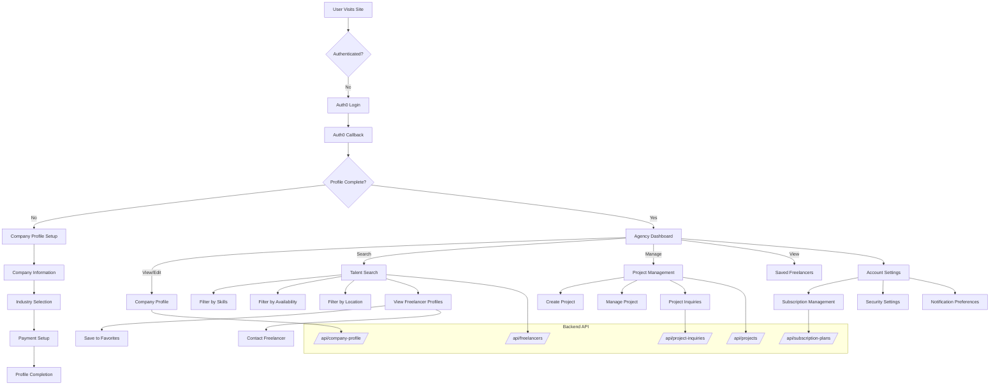
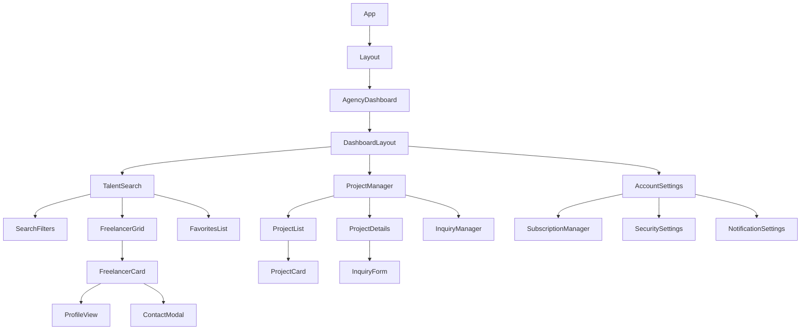

# Agency/Business Technical Flow



## API Endpoints Detail

### Company Profile Management
- `GET /api/company-profile/` - Retrieve profile
- `POST /api/company-profile/` - Create profile
- `PUT /api/company-profile/<id>/` - Update profile
- `PATCH /api/company-profile/<id>/` - Partial update

### Talent Search
- `GET /api/freelancers/` - Search freelancers
- `GET /api/favorites/freelancers/` - List favorite freelancers
- `POST /api/favorites/create/` - Add to favorites
- `DELETE /api/favorites/<id>/delete/` - Remove from favorites

### Project Management
- `GET /api/projects/` - List projects
- `POST /api/projects/` - Create project
- `PUT /api/projects/<id>/` - Update project
- `DELETE /api/projects/<id>/` - Delete project
- `GET /api/project-inquiries/` - List inquiries
- `POST /api/submit-inquiry/` - Submit inquiry

### Subscription Management
- `GET /api/subscription-plans/` - List plans
- `POST /api/create-subscription/` - Create subscription
- `PUT /api/update-payment-method/` - Update payment
- `POST /api/cancel-subscription/` - Cancel subscription

## Component Hierarchy



## State Management Flow

```mermaid
stateDiagram-v2
    [*] --> Dashboard
    
    Dashboard --> TalentSearch
    Dashboard --> ProjectManagement
    Dashboard --> Settings
    
    state TalentSearch {
        [*] --> SearchForm
        SearchForm --> Results
        Results --> FreelancerProfile
        FreelancerProfile --> Contact
        FreelancerProfile --> AddFavorite
    }
    
    state ProjectManagement {
        [*] --> ProjectList
        ProjectList --> CreateProject
        ProjectList --> ViewProject
        ViewProject --> ManageInquiries
        ViewProject --> EditProject
    }
    
    state Settings {
        [*] --> Profile
        Profile --> Subscription
        Profile --> Security
        Profile --> Notifications
    }
