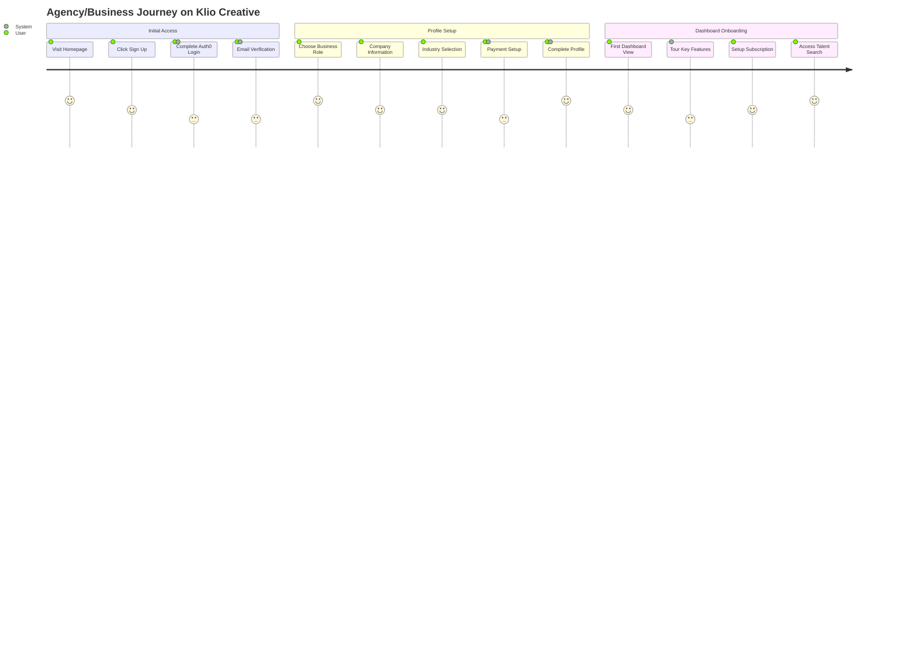
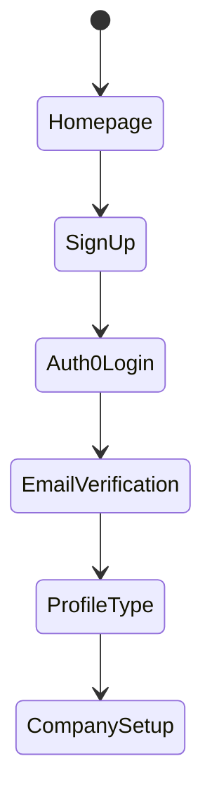
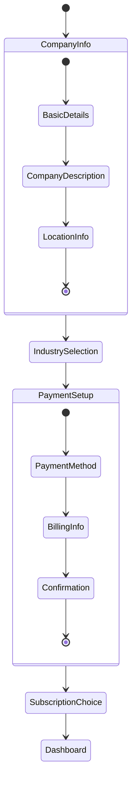
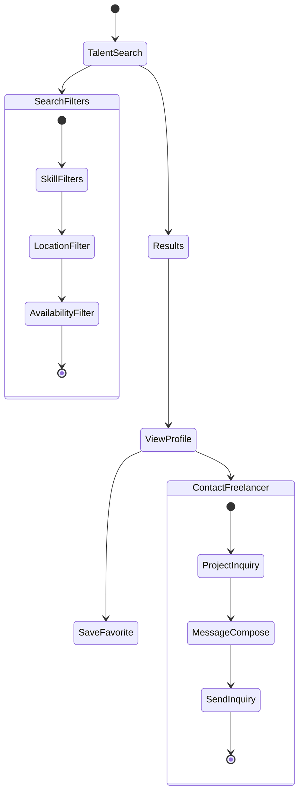

# Agency/Business User Journey Map

## Detailed User States & Interactions

### 1. Registration & Authentication

### 2. Company Profile Setup Experience

### 3. Talent Search & Management

## Key User Touchpoints & States

### Homepage to Registration
1. **Initial Landing**
   - View agency/business benefits
   - Access sign-up button
   - Review pricing plans

2. **Registration Flow**
   - Choose business account type
   - Complete Auth0 form
   - Verify email
   - Select subscription tier

### Company Profile Creation
1. **Basic Information**
   - Company details
   - Business description
   - Location settings
   - Industry selection

2. **Payment & Subscription**
   - Choose plan
   - Payment method setup
   - Billing information
   - Subscription activation

3. **Dashboard Setup**
   - Welcome orientation
   - Feature overview
   - Search preferences
   - Notification settings

### Talent Search Experience
1. **Search Configuration**
   - Skill requirements
   - Location preferences
   - Availability needs
   - Budget range

2. **Results Interaction**
   - Filter results
   - Sort options
   - Save favorites
   - Quick actions

3. **Freelancer Engagement**
   - View portfolios
   - Check availability
   - Send inquiries
   - Save contacts

### Project Management
1. **Project Creation**
   - Project details
   - Requirements specification
   - Timeline setting
   - Budget allocation

2. **Project Tracking**
   - Status updates
   - Inquiry management
   - Communication logs
   - Progress tracking

## Error States & Recovery Flows

### Common Error Scenarios
1. **Profile Setup Issues**
   - Incomplete information
   - Payment validation
   - Subscription errors
   - Integration failures

2. **Search & Contact Issues**
   - No search results
   - Contact failures
   - Message delivery issues
   - Connection timeouts

3. **Project Management Issues**
   - Creation errors
   - Update failures
   - Communication blocks
   - Status sync problems

### Recovery Paths
1. **Profile Recovery**
   - Save progress
   - Validation guidance
   - Payment retry
   - Support access

2. **Search Recovery**
   - Filter adjustments
   - Alternative searches
   - Saved drafts
   - Contact alternatives

3. **Project Recovery**
   - Auto-save features
   - Draft restoration
   - Alternative contacts
   - Support escalation

## Subscription Management
1. **Plan Selection**
   - Compare features
   - Review pricing
   - Check limitations
   - Select duration

2. **Payment Processing**
   - Method selection
   - Validation checks
   - Confirmation steps
   - Receipt generation

3. **Subscription Maintenance**
   - Usage tracking
   - Plan updates
   - Renewal management
   - Payment updates
