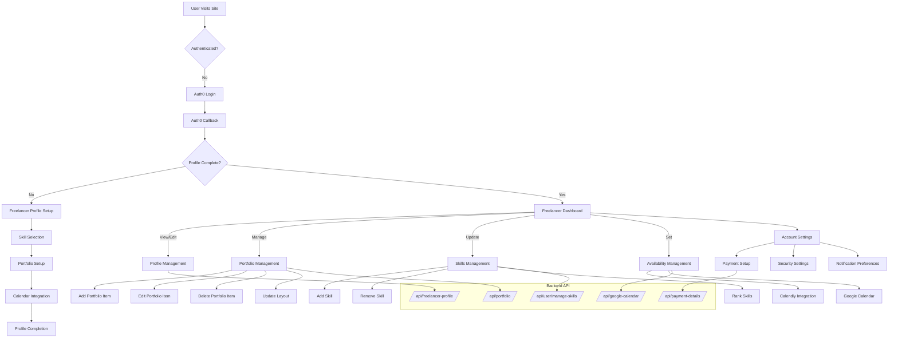

# Freelancer Technical Flow



## API Endpoints Detail

### Profile Management
- `GET /api/freelancer-profile/` - Retrieve profile
- `POST /api/freelancer-profile/` - Create profile
- `PUT /api/freelancer-profile/<id>/` - Update profile
- `PATCH /api/freelancer-profile/<id>/` - Partial update

### Skills Management
- `GET /api/user/manage-skills/` - List skills
- `POST /api/user/manage-skills/` - Add skill
- `DELETE /api/user/manage-skills/<id>/` - Remove skill
- `PATCH /api/user_skills/update_rank/` - Update skill ranking

### Portfolio Management
- `GET /api/portfolio/` - Get portfolio items
- `POST /api/portfolio/` - Create portfolio item
- `PUT /api/portfolio/<id>/` - Update item
- `DELETE /api/portfolio/<id>/` - Delete item
- `PATCH /api/portfolio-layout/` - Update layout

### Calendar Integration
- `GET /api/google-calendar/events/` - List events
- `POST /api/google-calendar/availability-event/` - Create availability
- `DELETE /api/google-calendar/availability-event/<id>/` - Remove availability

### Payment Setup
- `GET /api/payment-details/` - Get payment info
- `POST /api/setup-payment-method/` - Setup payment
- `PUT /api/update-payment-method/` - Update payment

## Component Hierarchy

```mermaid
graph TD
    App --> Layout
    Layout --> FreelancerDashboard
    FreelancerDashboard --> DashboardLayout
    DashboardLayout --> Portfolio
    DashboardLayout --> SkillsManager
    DashboardLayout --> AvailabilityCalendar
    DashboardLayout --> AccountSettings
    
    Portfolio --> PortfolioItem
    Portfolio --> PortfolioGrid
    
    SkillsManager --> SkillsList
    SkillsManager --> SkillsRanking
    
    AccountSettings --> PaymentDetails
    AccountSettings --> SecuritySettings
    AccountSettings --> NotificationSettings
