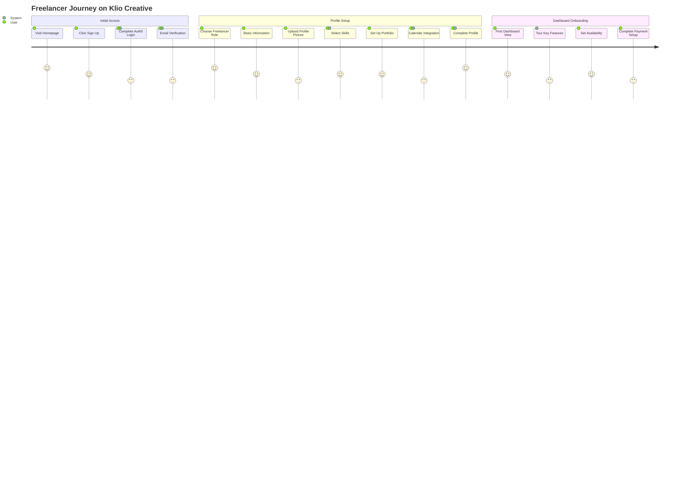
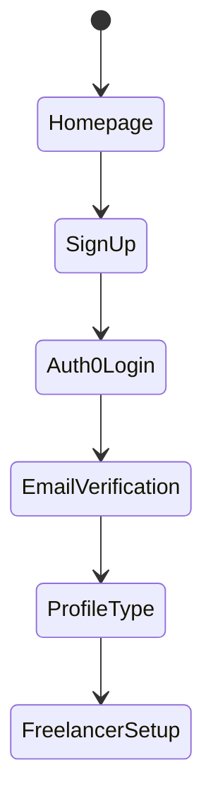
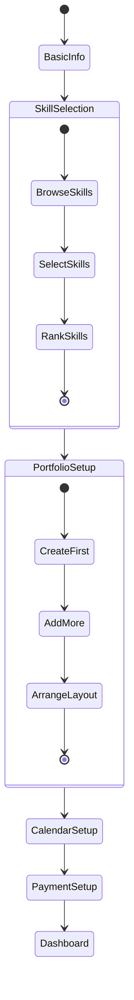
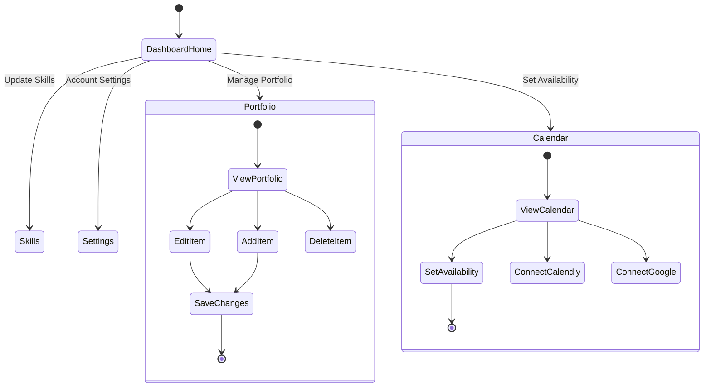

# Freelancer User Journey Map

## Detailed User States & Interactions

### 1. Registration & Authentication

### 2. Profile Setup Experience

### 3. Dashboard Interactions

## Key User Touchpoints & States

### Homepage to Registration
1. **Initial Landing**
   - View value proposition
   - Access sign-up button
   - View freelancer benefits

2. **Registration Flow**
   - Choose registration method
   - Complete Auth0 form
   - Verify email
   - Select user type

### Profile Creation
1. **Basic Information**
   - Personal details
   - Professional summary
   - Location settings
   - Profile picture upload

2. **Skills Configuration**
   - Browse skill categories
   - Select relevant skills
   - Rank proficiency
   - Add custom skills

3. **Portfolio Setup**
   - Create first item
   - Add project details
   - Upload media
   - Arrange layout

4. **Calendar Integration**
   - Choose calendar provider
   - Set availability
   - Configure preferences
   - Sync settings

### Dashboard Experience
1. **First-time Login**
   - Welcome tour
   - Feature highlights
   - Quick setup guides
   - Next steps

2. **Regular Usage**
   - Portfolio management
   - Skills updates
   - Availability changes
   - Profile optimization

## Error States & Recovery Flows

### Common Error Scenarios
1. **Authentication Issues**
   - Invalid credentials
   - Email verification failed
   - Session timeout
   - 2FA problems

2. **Profile Setup Issues**
   - Missing required fields
   - Upload failures
   - Integration errors
   - Validation problems

3. **Dashboard Operations**
   - Save failures
   - Update errors
   - Connection issues
   - Sync problems

### Recovery Paths
1. **Authentication Recovery**
   - Password reset
   - Email reverification
   - Support contact
   - Account recovery

2. **Data Entry Recovery**
   - Auto-save drafts
   - Validation guidance
   - Error messaging
   - Help resources

3. **Technical Recovery**
   - Retry options
   - Alternative paths
   - Support access
   - Status updates
